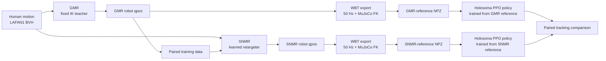
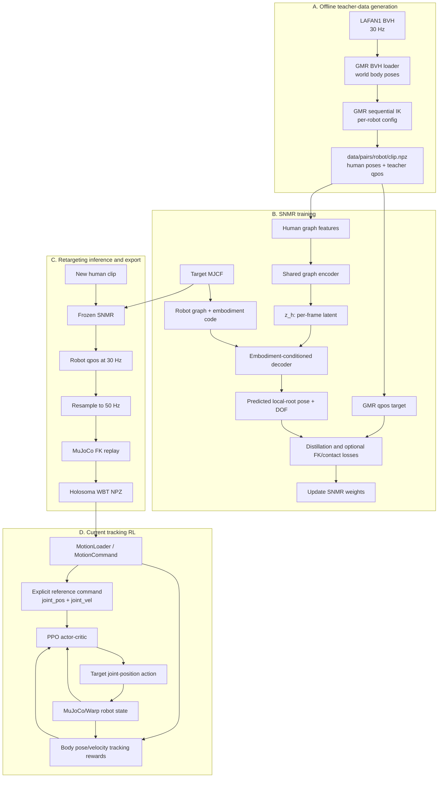
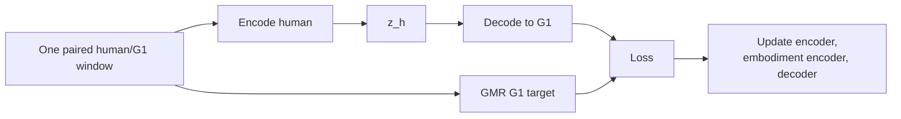
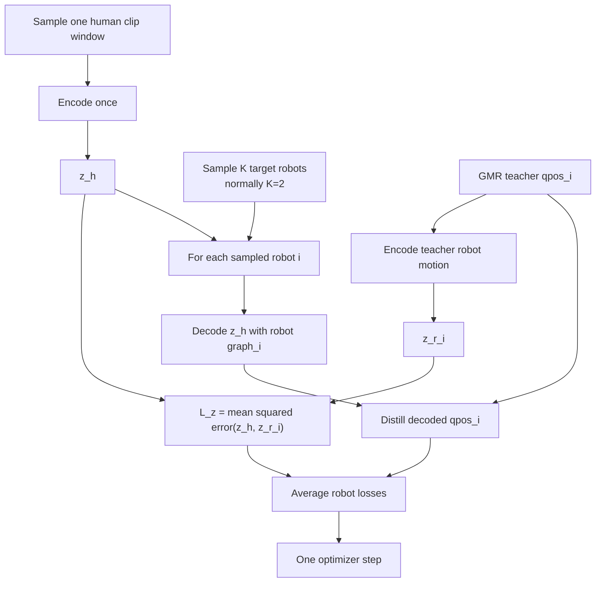
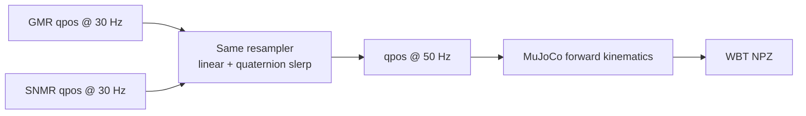
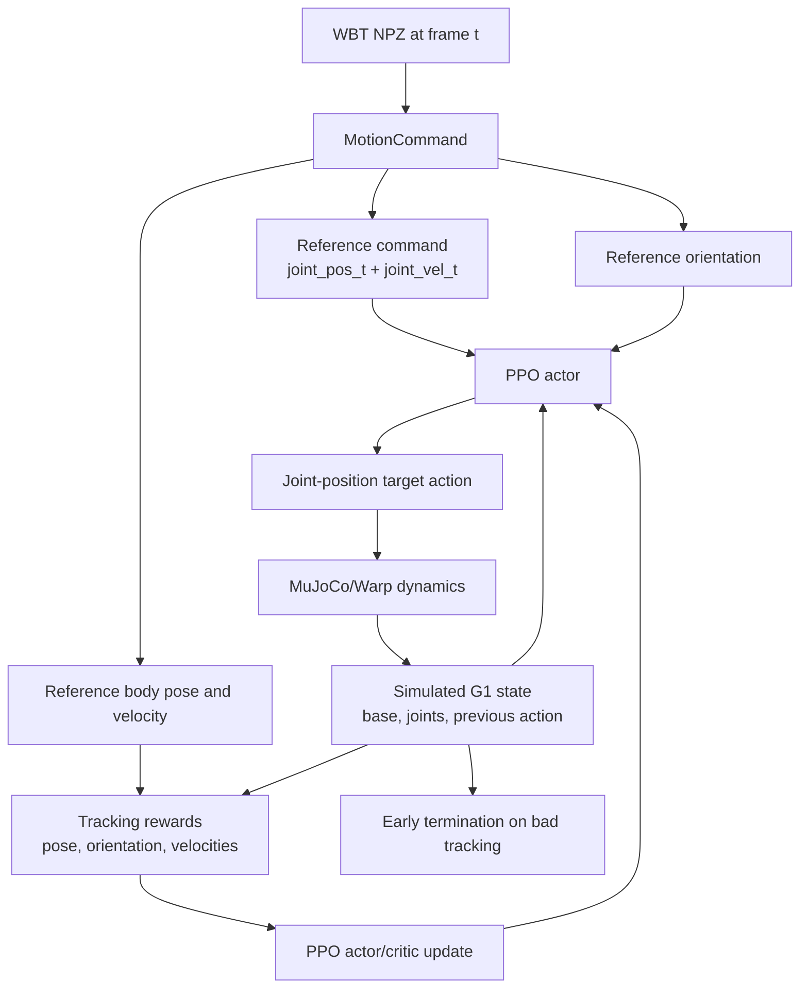
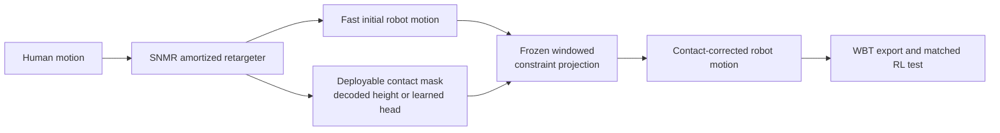
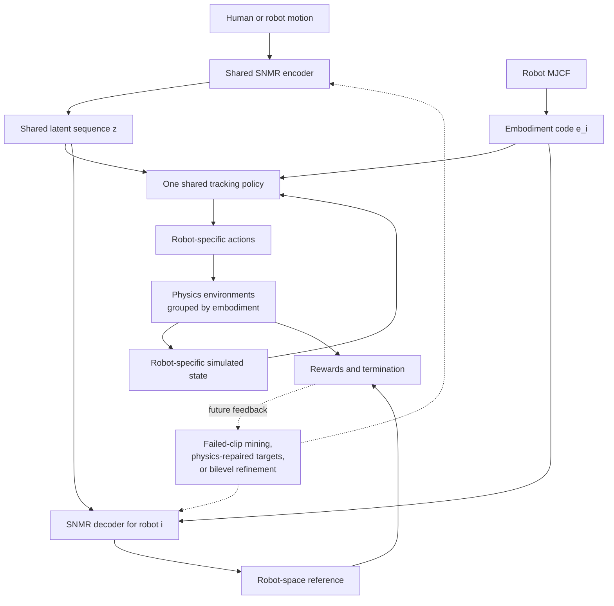

# SNMR Current Architecture and Workflow

**Status snapshot: 2026-07-14.** This guide describes the code and experiment artifacts that
currently exist. It separates them from the proposed next method and the longer-term shared
tracking framework. For experiment decisions, `docs/NEURAL_RETARGETING_RESEARCH_sol.md` remains
the frozen record.

## 1. The shortest useful explanation

There are three different systems:

1. **GMR** is a fixed, per-robot inverse-kinematics retargeter. We use it offline to create
   supervision for SNMR and as the baseline source of reference motions.
2. **SNMR** is the learned retargeter. It maps human motion through a shared latent `z_t` and a
   target-robot graph to robot `qpos`.
3. **Holosoma WBT** is a separate reinforcement-learning controller. It learns a policy that
   physically tracks a robot reference trajectory in simulation.

The current WBT policy does **not** train SNMR, does **not** run GMR online, and does **not**
consume SNMR's latent. It consumes explicit robot-space reference positions and velocities from
an NPZ file.



The two PPO branches use the same robot, simulator, policy architecture, rewards, randomization,
clip, and seed. The reference-motion source is the intended experimental difference.

## 2. Current status versus proposal

| Layer | What exists now | Status |
|---|---|---|
| GMR teacher data | 77 LAFAN1 clips x 5 robots, 2.48M paired frames | Implemented |
| Phase 1 SNMR | Human to one robot, G1 specialist | Implemented and trained |
| Phase 2 SNMR | One shared model across five trained robots with latent consistency | Implemented and trained |
| Zero-shot new robot | Decode from an unseen MJCF-derived embodiment code | Tested; failed at current scale |
| Contact-aware output | Soft objectives and source-mask projection | Tested; registered endpoints failed |
| Oracle contact projection | Same projection with teacher-height contact mask | Passes; identifies mask quality as the gap |
| WBT data handoff | SNMR/GMR `qpos` to matched Holosoma NPZs | Implemented |
| WBT Stage A | Separate G1 PPO policies trained on GMR or SNMR references | Implemented and run |
| Formal tracking verdict | Non-inferiority/benefit after a sufficiently trained GMR control | Unresolved |
| Latent NPZ and loader hook | `latent_z` export and Holosoma loader/observation monkeypatch | Implemented infrastructure only |
| Latent-command WBT policy | Policy observes `z` instead of explicit joint command | Proposed, not trained |
| Shared multi-robot WBT policy | One embodiment-conditioned policy for several robots | Proposed |
| RL-to-retargeter feedback | Physics-repaired targets or bilevel co-optimization | Proposed fallback |

The current horizon-calibration artifact is incomplete. Walk reaches 88% 10-second completion at
8,000 PPO iterations, while dance reaches 10% and misses the frozen 25% per-clip floor. The fight
continuation produced a 6,000-iteration checkpoint but no 8,000-iteration checkpoint, reports, or
`COMPLETE` marker. Therefore the repository does not yet contain a valid E35 final verdict.

## 3. End-to-end repository workflow



Data generation and SNMR training are offline. Retargeting inference is a feed-forward model call.
WBT then trains a new controller against the exported trajectory; WBT is not part of SNMR's
backpropagation graph.

## 4. What GMR does in this project

GMR has four roles, and mixing them together causes most of the conceptual confusion.

| GMR role | Relationship |
|---|---|
| **Teacher** | GMR converts each human clip to each robot's `qpos`; SNMR learns to reproduce it. |
| **Paired-data generator** | The same human motion and GMR robot motion are stored together in each training NPZ. |
| **Evaluation reference** | SNMR MPJPE and DOF errors are measured against GMR teacher trajectories. |
| **WBT control source** | GMR trajectories are exported through the same converter as SNMR trajectories and train control policies for the matched RL comparison. |

GMR is **not**:

- a module inside the SNMR network;
- called during ordinary SNMR inference;
- updated by SNMR training;
- an RL policy;
- called inside each WBT simulation step.

Its hand-tuned mappings and sequential IK are paid once when generating the paired dataset. SNMR's
research purpose is to amortize that solve into one batched neural model.

## 5. The SNMR model

### 5.1 Model-level diagram

```mermaid
flowchart LR
    subgraph SRC["Human source"]
        HP["World body position<br/>(T, 24, 3)"]
        HQ["World body quaternion<br/>(T, 24, 4), wxyz"]
        HS["Human static graph<br/>offset, axis slots, DOF, EE"]
        HP --> CAN["Heading/translation<br/>canonicalization"]
        HQ --> CAN
        CAN --> X["Dynamic node features<br/>position 3 + rotation 6D 6 + velocity 3"]
    end

    X --> CAT["Concatenate static features"]
    HS --> CAT
    CAT --> GAT["Shared-weight GAT stack"]
    GAT --> POOL["Max pool over nodes"]
    POOL --> LT["Per-frame latent"]
    LT --> TEMP["Optional temporal Transformer"]
    TEMP --> Z["z_(1:T)<br/>current main model: d=128"]

    subgraph TGT["Target robot from MJCF"]
        RS["Robot static graph<br/>rest offset, hinge axis,<br/>has-DOF, end-effector"]
        RS --> EE["Embodiment encoder<br/>MLP + max pool"]
        EE --> E["embodiment code"]
    end

    Z --> BROAD["Broadcast z to robot nodes"]
    RS --> BROAD
    BROAD --> DGAT["Decoder GAT layers<br/>latent/static reinjection"]
    E --> ADA["AdaLN conditioning"]
    ADA --> DGAT
    DGAT --> HEADS["Root, hinge-angle,<br/>optional contact heads"]
    HEADS --> LOCAL["Local root position + quaternion<br/>joint angles within limits"]
    LOCAL --> WORLD["Compose with scaled<br/>human root trajectory"]
    WORLD --> Q["MuJoCo qpos<br/>root xyz + root wxyz + DOF"]
```



### 5.2 Important contracts

- **Skeleton agnosticism:** graph weights are shared across nodes and max pooling removes the node
  count. Human and robot graphs can have different topologies.
- **Shared latent:** `z_t` should describe motion content rather than one robot. In Phase 2,
  human and robot encodings of the same teacher-paired frame are pulled together by `L_z`.
- **Embodiment conditioning:** target-robot static features are pooled into a code and applied to
  decoder layers through AdaLN.
- **Joint limits:** each hinge head uses `tanh`, then maps `[-1, 1]` into the MJCF joint range.
- **Quaternion convention:** internal and WBT `qpos` quaternions are `wxyz`.
- **Root frame:** the decoder does not predict an absolute world trajectory. It predicts the robot
  root relative to a per-robot-scaled human root in the human heading frame. Inference composes the
  prediction back into the world.
- **Temporal caveat:** the original Transformer has no positional encoding by default. The
  no-temporal ablation does not settle whether order-aware temporal modeling helps.
- **Contact head:** it is optional and checkpoint-dependent. It is not part of every trained model.

### 5.3 Why the scaled root anchor exists

The encoder deliberately removes global XY translation and yaw. It therefore cannot infer an
absolute world root. A raw human-relative root is also insufficient because GMR scales the human
trajectory differently for each robot. Training uses:

```text
scaled human root XY = per_robot_scale * human root XY
decoder target       = robot root expressed in scaled-human heading frame
world robot root     = scaled human anchor composed with decoder output
```

This makes the target compatible with the information available to the encoder.

## 6. How SNMR is trained

### 6.1 Phase 1: one-robot specialist



This establishes that the architecture can learn human-to-robot retargeting for one embodiment.

### 6.2 Phase 2: shared five-robot model



Baseline trained objectives are configuration-space distillation, the redundant joint-limit
safety loss, smoothness, and Phase-2 latent consistency. The repository also implements
differentiable-FK task/contact/penetration/velocity losses, but these are optional experiment arms;
they should not be described as active in every baseline checkpoint.

`zr_decode_prob` can sometimes decode from a robot encoding instead of `z_h`, addressing the
measured robot-to-robot distribution gap. The option is wired into the trainer but remains a
deferred experiment. Without it, `z_r` primarily supplies latent-alignment supervision.

## 7. The WBT export boundary

Both sources are deliberately passed through the same export path:



The WBT NPZ contains:

```text
fps
joint_pos       = root position + root quaternion + robot DOF
joint_vel       = root linear/angular velocity + DOF velocity
body_pos_w
body_quat_w
body_lin_vel_w
body_ang_vel_w
joint_names
body_names
```

This boundary is important: after export, Holosoma does not know whether the trajectory came from
GMR or SNMR.

## 8. Current motion-tracking RL experiment

### 8.1 What the policy sees and learns



The actor receives the explicit reference joint command, reference orientation, current base/joint
state, and previous action. The critic receives additional reference and simulated body state.
Rewards track global and relative body pose and velocity, with action-rate, joint-limit, and
undesired-contact penalties. The current action is a target robot joint position.

### 8.2 What is being compared

For each clip and training seed, two independent policies are trained:

```text
Policy A: same WBT setup + GMR-reference NPZ
Policy B: same WBT setup + SNMR-reference NPZ
```

This answers: **does changing only the retargeted training reference change downstream physical
tracking quality?**

It does not yet answer:

- whether one policy can track several robots;
- whether `z` is a better policy command;
- whether RL can improve SNMR;
- whether SNMR is formally non-inferior to GMR at a sufficient policy-training budget.

### 8.3 Current evidence

- MuJoCo/Warp WBT smoke testing passed.
- The three-clip x two-source x three-seed pilot produced 18 complete 1,000-iteration policies.
- Training curves were mixed and small; SNMR joint error was favorable in 8/9 matched pairs.
- The 5,400 fixed-rollout evaluation had 0% 10-second completion for both sources.
- Because the GMR control also failed, the formal result is **undertrained control**, not
  equivalence, non-inferiority, or benefit.
- GMR-only horizon calibration shows that policy-training budget matters strongly and differs by
  clip, but the calibration artifact is not yet complete.

## 9. Proposed method and framework

There are two proposal horizons. They should not be presented as though both are already the
current system.

### 9.1 Near-term proposed method: amortize, then project

The current neural model has low pose error but residual stance-foot motion. Soft contact losses
did not meet the registered endpoint. A frozen windowed constrained projection succeeds with an
oracle contact mask, so the proposed near-term method is:



SNMR solves most of the pose rapidly; projection handles the remaining exact contact constraint.
The unresolved part is a deployable mask that reproduces the oracle result without violating pose
and smoothness guards.

### 9.2 Longer-term proposed framework: latent-command shared tracking

The original C2 proposal goes further:



In this target design:

- the **policy observation/command** becomes `z` plus an embodiment code and robot state;
- the **reward target** remains decoded in robot space because physics errors must be measured
  against robot bodies, joints, and contacts;
- one policy is trained over several embodiments;
- failed physics rollouts can later improve the retargeter.

What exists toward this target:

- `scripts/export_wbt_with_latent.py` writes time-aligned `latent_z` into a WBT NPZ;
- `snmr/integration/wbt_latent.py` loads it and exposes the current-frame latent as an observation.

What is still missing:

- an adopted Holosoma observation configuration for the latent experiment;
- latent horizon/window construction and embodiment-code observation;
- a trained latent-command baseline;
- WBT configurations for additional robots;
- multi-embodiment environment batching and policy training;
- any RL gradient or repaired-data feedback into SNMR.

## 10. Relationship matrix

| From | To | Current relationship |
|---|---|---|
| Human motion | GMR | Input to offline IK |
| Human motion | SNMR | Input to learned encoder |
| GMR | SNMR | Teacher qpos, latent pairing, and benchmark reference |
| SNMR latent `z` | SNMR decoder | Current internal command representation |
| GMR qpos | WBT | Baseline reference NPZ |
| SNMR qpos | WBT | Experimental reference NPZ |
| SNMR latent `z` | WBT actor | Infrastructure exists; policy experiment not run |
| WBT rollouts | SNMR | No current training connection |
| WBT rollouts | SNMR, proposed | Hard-clip mining, physics-repaired supervision, or joint optimization |

## 11. Code map

| Concern | Main files |
|---|---|
| GMR pair generation | `scripts/make_pairs_lafan1.py`, `docs/DATA.md` |
| Human features and contacts | `snmr/human.py` |
| Robot graph and differentiable FK | `snmr/robot_model.py`, `snmr/skeleton.py` |
| Canonical frames and motion data | `snmr/data.py`, `snmr/rotation.py` |
| Encoder, latent, embodiment code, decoder | `snmr/model.py` |
| Training objectives | `snmr/losses.py` |
| Single-robot training | `scripts/train_phase1.py` |
| Shared five-robot training | `scripts/train_phase2.py` |
| Retargeting metrics | `snmr/metrics.py`, `scripts/benchmark.py` |
| Contact projection | `snmr/projection.py`, `snmr/footlock.py` |
| WBT conversion | `scripts/export_wbt_npz.py` |
| Matched GMR/SNMR package | `scripts/prepare_wbt_validation.py` |
| WBT analyses | `scripts/analyze_wbt_pilot.py`, `scripts/analyze_wbt_rollouts.py`, `scripts/analyze_wbt_horizon.py` |
| Latent WBT bridge | `scripts/export_wbt_with_latent.py`, `snmr/integration/wbt_latent.py` |
| Frozen decisions and results | `docs/NEURAL_RETARGETING_RESEARCH_sol.md`, `docs/EXPERIMENT_LOG.md` |
| Proposed next revision | `docs/NEURAL_RETARGETING_RESEARCH_fable.md` |

## 12. Common questions

**Is SNMR the tracking policy?**

No. SNMR creates a reference motion. Holosoma trains a separate feedback controller to execute it
under physics.

**Does SNMR replace GMR everywhere?**

At inference, that is the goal. During research, GMR remains the supervision source and matched
baseline.

**Does the current policy use the shared latent?**

No. It uses explicit robot joint positions and velocities. The latent bridge is preparatory code.

**Why decode `z` again if a future policy already sees `z`?**

The policy may use `z` as a compact command, but rewards and termination still need concrete
robot-space poses, velocities, and contacts.

**Why train separate GMR and SNMR policies?**

To isolate reference-data quality. Sharing one policy between sources would confound the result.

**Does RL currently make SNMR more physical?**

No. Physics feedback is a proposed future training loop. The frozen projection passes with an
oracle mask, but every deployable-mask arm failed; mask and solver iteration is now closed.

**What is the central current research question?**

Whether one shared neural retargeter can amortize GMR across trained robots while producing
references that are as useful for physical WBT policy training, with contact handled by a precise,
lightweight correction stage when necessary.
