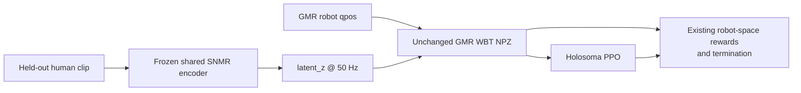

# GMR Reference + SNMR Latent WBT Study

**Protocol frozen before latent-policy training: 2026-07-14.**

## Question

Can a frozen SNMR latent improve Holosoma whole-body tracking while retaining the higher-quality
GMR robot reference for initialization, rewards, termination, and official evaluation?

The controlled boundary is:



No SNMR-decoded `qpos` enters this study. Every arm tracks the same GMR trajectory.

## Three proposed integrations

### S1: Dual-space current command

Actor and critic receive:

```text
[GMR joint_pos_t, GMR joint_vel_t, z_t]
```

`z_t` supplies a morphology-aligned motion coordinate alongside the exact GMR robot target. This is
the smallest test of whether the shared representation contains useful phase/style information not
easily extracted by the policy MLP from one explicit joint frame.

### S2: Latent tangent preview

Actor and critic receive:

```text
[GMR command_t, z_t, z_(t+0.2s) - z_t, z_(t+0.5s) - z_t]
```

The latent differences describe short- and medium-horizon motion direction. This adds anticipation
without replacing the GMR target or exposing future robot joint targets. Preview indices are clipped
at the current clip boundary.

### S3: Privileged latent critic

The actor remains exactly on the baseline observation. Only the critic receives the S2 preview.
This is asymmetric actor-critic training: the latent may improve value estimation and PPO credit
assignment, but the deployed actor has no latent dependency and no extra input parameters.

## Why these three

- They preserve the established GMR reference and official WBT reward/evaluation path.
- They are incremental and attributable: current semantics, anticipatory semantics, and
  training-only privileged semantics.
- They require no online SNMR inference; `latent_z` is computed once per offline reference clip.
- S3 separates representation benefit from merely increasing actor capacity.
- More invasive latent rewards, online robot-state encoding, and joint SNMR/PPO training are deferred
  until this low-risk observation study shows that the latent is useful at all.

## Screening protocol

| Item | Frozen value |
|---|---|
| Clip | `walk1_subject5` |
| Reference | Existing GMR WBT NPZ, unchanged standard fields |
| SNMR latent | Phase-2 all-five checkpoint, human encoding, 128 dimensions |
| Simulator | Holosoma MuJoCo/Warp |
| Algorithm | Existing WBT PPO |
| Environments | 1,024 |
| Training seed | 0 |
| PPO iterations | 8,000 from scratch |
| Evaluation | Official terminal-aware WBT evaluator |
| Evaluation seed | 404 |
| Windows | 100 phase-stratified 10-second windows |
| Baseline | Existing GMR seed-0 8,000-iteration checkpoint and seed-404 report |

The existing baseline has 88% completion and 8.953 s mean survival. Reusing it avoids spending
another two hours on an identical deterministic training arm.

## Endpoints and promotion

Primary screening endpoints are 10-second completion, survival, and joint-position RMSE. All
official root/body errors, undesired contact, torque, power, and joint-limit metrics are retained.

An arm is eligible for replication only if:

1. completion is no more than 5 percentage points below baseline; and
2. it improves joint-position RMSE by at least 5%, survival by at least 5%, or completion by at
   least 5 percentage points.

This one-clip, one-training-seed screen cannot establish tracking benefit. A promoted arm must be
rerun with independent training seeds and evaluation seeds, then tested on dance/fight and the
larger held-out clip set.

## Confounds recorded in advance

- S1/S2 increase actor input width and therefore first-layer parameter count. S3 does not.
- The latent encoder is bidirectional/offline; this study targets offline reference-conditioned WBT,
  not live causal human teleoperation.
- `z_t` is deterministic from the same held-out human clip, so the study tests optimization and
  representation usefulness within a trajectory, not generalization to unseen motion categories.
